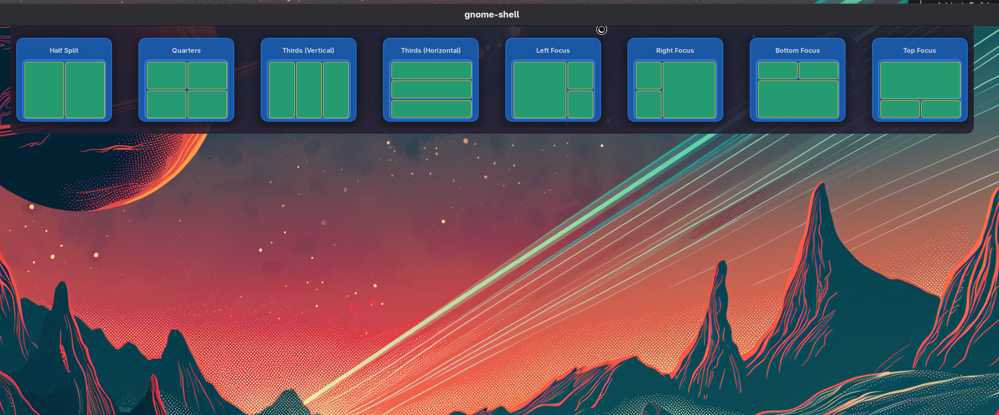
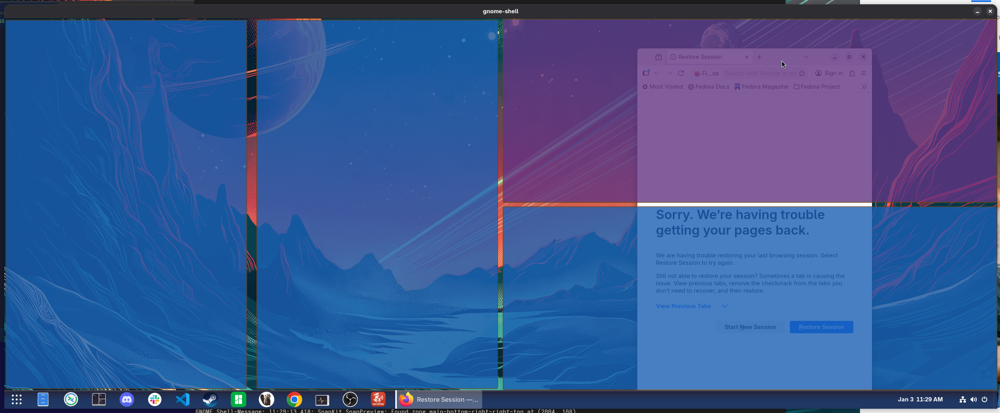

# SnapKit

A GNOME Shell extension that brings Windows 11-style snap layouts to Linux with enforced tiling.





## Overview

SnapKit provides a window snapping experience similar to Windows 11's Snap Layouts feature. Move your mouse to the top edge of the screen to reveal a layout picker, select a zone, and snap windows into predefined arrangements.

Unlike basic window snapping, SnapKit acts as an enforcing tile manager. Once windows are snapped into a layout, they maintain their grid relationship. Resize one window and adjacent windows automatically adjust to preserve the layout structure. No gaps, no overlaps - the grid stays intact.

This is an early implementation. The goal is to replicate the intuitive window management that Windows 11 introduced, making it available for GNOME desktop users.

## Features

### Core Snapping Features

- **Snap Layouts**: 8 preset layouts including half-split, quarters, thirds, and focus layouts
- **Zone Selection**: Hover at screen edge to reveal layout picker, click a zone to enter snap mode
- **Window Selector**: Visual overlay showing available windows with thumbnails
- **Drag-to-Snap**: Drag any window to see a snap grid overlay, then drop into zones for instant snapping
- **Enforced Tiling**: Windows snapped together maintain their grid layout - drag a shared border and adjacent windows adjust automatically, preserving the tile structure
- **Zone Splitting**: Drop windows near zone edges to automatically split them into half-zones
- **Minimized Window Support**: Snap minimized windows directly from the selector
- **Per-Monitor Layout Persistence**: Each monitor remembers its last-used layout between sessions

### Interaction Features

- **Multi-Monitor Support**: Works with primary, current, or all monitors
- **Configurable Trigger**: Adjustable trigger zone size, position (top/bottom/left/right), and push delay
- **Auto-Hide**: Optional automatic hiding of trigger zone when not in use
- **Shake-to-Dismiss**: Rapidly shake mouse left-right while dragging to dismiss snap grid
- **Snap Disable Key**: Hold Escape or Space while dragging to temporarily disable snap preview

### Customization Features

- **Custom Layout Editor**: Visual drag-and-drop editor to create your own layouts with custom zone arrangements
- **Layout Management**: Enable/disable individual layouts, set default snap layout
- **Extensive Appearance Options**: 
  - Customizable colors for overlays, zones, borders, and highlights
  - Gradient backgrounds (vertical, horizontal, radial) or solid colors
  - Adjustable opacity, scale, spacing, and animation durations
  - Warning colors for zones too small for windows
- **Window Thumbnail Settings**: Customize size, padding, and labels in SNAP MODE
- **Zone Size Validation**: Visual warnings for zones smaller than configured minimums

## Installation

### From Source

```bash
git clone https://github.com/user/snapkit.git
cd snapkit
make install
make enable
```

Then restart GNOME Shell:
- X11: Press Alt+F2, type `r`, press Enter
- Wayland: Log out and log back in

### Development

To test changes in a nested GNOME Shell session (recommended for Wayland):

```bash
make dev
```

This opens a sandboxed GNOME Shell window where you can test the extension without affecting your main session.

## Usage

### Basic Snapping

1. Move your mouse to the top edge of the screen (or configured trigger edge)
2. After a brief delay, the layout picker appears
3. Click on a layout zone to enter snap mode
4. Click on a window thumbnail to snap it to that zone
5. Repeat for additional zones, or click "Skip This Zone" to leave a zone empty
6. Press ESC or click the background to cancel

### Drag-to-Snap (Quick Mode)

1. Start dragging any window
2. A snap grid automatically appears showing available zones
3. Drag the window over your desired zone (it will highlight)
4. Release to snap the window into that zone
5. Press ESC or Space while dragging to disable snap preview for that drag
6. Rapidly shake mouse left-right to dismiss the snap grid

### Zone Splitting

When using drag-to-snap, you can split zones on the fly:
1. Drag a window near the edge of an existing zone (within 30% by default)
2. The zone preview will show a split half-zone
3. Drop to snap to that half, automatically creating a split layout
4. The other half remains available for another window

### Enforced Tiling

Once windows are snapped to a layout, SnapKit enforces the grid structure:
- Drag a shared border between windows to resize them together
- The resize cascades through the layout: if window A's edge affects window B, and B shares an edge with C, then C also adjusts
- The grid remains gap-free and overlap-free
- Drag a window away to remove it from the tile group and regain independent control

## Configuration

Right-click the trigger zone to open preferences, or run:

```bash
gnome-extensions prefs snapkit@watkinslabs
```

### Appearance Settings

**Main Overlay Background**
- Background type: Solid color, vertical/horizontal/radial gradients
- Background colors (start and end for gradients)
- Overall opacity (0.0 - 1.0)

**Trigger/Hitbox Indicator**
- Background color for the trigger strip when closed

**Layout Cards**
- Card background and border colors
- Grid border color
- Layout spacing between cards
- Show/hide layout names

**Zone Styling**
- Zone background and border colors
- Highlight color for hover states
- Warning color for zones too small for windows
- Minimum zone width and height thresholds

**Snap Preview (Drag-to-Snap)**
- Grid zone color
- Grid border color
- Highlight color
- Preview opacity
- Zone split preview color

### Behavior Settings

**Trigger Settings**
- Trigger edge orientation (top, bottom, left, right)
- Trigger zone height (1-100 pixels)
- Push delay before opening (0-2000ms, 0=instant)

**Overlay Size**
- Overlay scale factor (0.5 - 2.0)

**Monitor & Auto-hide**
- Monitor mode: Primary only, Current (follows mouse), or All monitors
- Auto-hide: Automatically hide overlay when mouse leaves
- Animation duration (0-1000ms)

**SNAP MODE**
- Timeout before auto-exit (10-300 seconds)
- Maximum window thumbnails to show (4-20)

**Snap Preview (Drag-to-Snap)**
- Enable/disable snap preview grid
- Default snap layout for drag operations
- Auto-snap on release (automatically snap when dropped over zone)
- Snap disable key (Escape or Space) - press while dragging to skip snap

**Shake to Dismiss**
- Enable/disable shake detection
- Direction changes needed (2-6, lower=more sensitive)
- Time window for detection (200-1000ms)
- Minimum movement threshold (10-100 pixels)

**Zone Splitting**
- Enable/disable zone splitting on edge drops
- Edge threshold (15%-45% of zone size)

### Snap Mode UI Settings

**Window Previews**
- Thumbnail width (200-600px)
- Thumbnail height (180-500px)
- Thumbnail padding (0-64px)
- Show/hide window labels

### Layouts

**Preset Layouts**
- Enable/disable individual layouts:
  - Half Split
  - Quarters
  - Thirds (Vertical/Horizontal)
  - Left/Right/Top/Bottom Focus

**Custom Layouts**
- Create new layouts with visual editor
- Edit existing custom layouts
- Delete custom layouts
- Drag-and-drop zone creation and resizing
- Real-time preview of zone arrangements

### Advanced Settings

- Motion event throttle interval (8-100ms)
- Disable native GNOME edge tiling
- Debug mode for troubleshooting

## Layouts

| Layout | Description |
|--------|-------------|
| Half Split | Two equal columns |
| Quarters | Four equal quadrants |
| Thirds (Vertical) | Three equal columns |
| Thirds (Horizontal) | Three equal rows |
| Left Focus | Large left zone, two stacked right zones |
| Right Focus | Two stacked left zones, large right zone |
| Top Focus | Large top zone, two bottom zones |
| Bottom Focus | Two top zones, large bottom zone |

## Requirements

- GNOME Shell 45 or later
- GLib, Clutter, St (included with GNOME)

## Known Limitations

- Some applications with minimum size constraints may not fit in smaller zones (indicated with a warning badge)
- Keyboard shortcuts for direct zone snapping are planned for future releases

## Building

```bash
make help          # Show available targets
make install       # Install to user directory
make uninstall     # Remove from user directory
make enable        # Enable the extension
make disable       # Disable the extension
make reload        # Reinstall and reload
make dev           # Test in nested GNOME Shell
make deploy        # Create distributable zip
make clean         # Remove build artifacts
```

## License

This project is open source. See LICENSE file for details.

## Contributing

Contributions are welcome. Please open an issue to discuss proposed changes before submitting a pull request.
