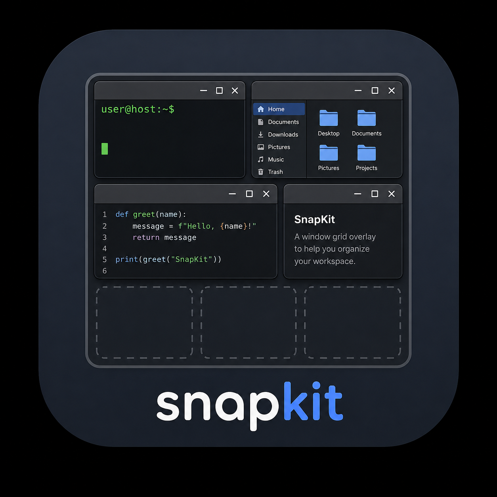

# SnapKit



SnapKit is a GNOME Shell extension for Windows-style window snapping with a layout picker, visual snap zones, and BTree-based layouts.

It was built to make window placement feel quick: drag a window toward the configured screen edge, pick a layout zone, and SnapKit moves the window into place. It also supports keyboard snapping, per-monitor layout memory, custom layout JSON, and divider overrides for resized snapped windows.

## What We Made

- A GNOME Shell extension named `snapkit@watkinslabs`.
- A layout picker bar that docks to a configurable edge: `top`, `bottom`, `left`, or `right`.
- Drag-to-zone snapping for normal application windows.
- Click-to-snap from the picker for the currently focused window.
- Global keyboard shortcuts for halves, quarters, layout cycling, and zone movement.
- Built-in layouts including full screen, 2x2, 3x3, halves, quarters, thirds, focus layouts, triple columns, and triple rows.
- BTree layout resolution with support for custom layouts and persisted divider overrides.
- Preferences pages for appearance, edge/corner trigger behavior, snapping behavior, default layout, workspace options, and advanced JSON storage.
- User install, build, and release helpers through `make`.

## Requirements

- GNOME Shell 45, 46, 47, or 48.
- `gnome-extensions`
- `glib-compile-schemas`
- `zip` for release packages.

You can check the required command-line tools with:

```bash
make check-deps
```

## Install

From the repository root:

```bash
make install
make enable
```

Then restart GNOME Shell:

- X11: press `Alt+F2`, type `r`, then press Enter.
- Wayland: log out and log back in.

Check the installed extension state with:

```bash
make status
```

Remove it with:

```bash
make uninstall
```

## How To Use SnapKit

Move your pointer to the configured trigger edge. By default, SnapKit uses the top edge. The schema and runtime support `top`, `bottom`, `left`, and `right` docking through the `trigger-edge` setting. The layout picker appears with available layout templates and clickable zones.

To snap by dragging, drag a normal app window toward the trigger edge, hover the desired template zone, and release the window. SnapKit uses the drop position and monitor to decide where the window should go.

To snap by clicking, focus a window, open the picker, and click a zone. SnapKit snaps the focused window into that zone.

To change behavior and appearance, open the extension preferences from GNOME Extensions. Current preferences include zone colors, borders, label size, animation settings, edge/corner trigger enablement and sizing, drag snapping behavior, the drag modifier key, default layout, per-workspace layout memory, and advanced JSON fields for stored layouts and overrides.

## Default Shortcuts

| Shortcut | Action |
| --- | --- |
| `Super+Space` | Toggle the overlay/picker |
| `Super+Left` | Snap focused window left |
| `Super+Right` | Snap focused window right |
| `Super+Up` | Snap focused window to top half |
| `Super+Down` | Snap focused window to bottom half |
| `Super+Alt+Left` | Snap focused window top-left |
| `Super+Alt+Right` | Snap focused window top-right |
| `Super+Shift+Left` | Snap focused window bottom-left |
| `Super+Shift+Right` | Snap focused window bottom-right |
| `Super+Control+Space` | Cycle layouts on the focused window's monitor |
| `Super+Control+Arrow` | Move focused window to a neighboring zone |
| `Super+Control+[` / `Super+Control+]` | Move focused window to previous / next zone |

The schema also defines empty direct zone bindings for zones 1 through 9, so those can be assigned manually through GSettings if wanted.

## Built-In Layouts

SnapKit currently registers these layouts:

- `grid-1x1` - full screen
- `grid-2x2` - four-zone grid
- `grid-3x3` - nine-zone grid
- `half-split` - left/right halves
- `half-horizontal` - top/bottom halves
- `quarters` - four equal quarters
- `thirds-vertical` and `thirds-horizontal`
- `left-focus`, `right-focus`, `top-focus`, `bottom-focus`, and `center-focus`
- `triple-columns` and `triple-rows`

The default layout in the schema is `grid-2x2`.

## Development

The source extension lives in `snapkit@watkinslabs/`.

Useful commands:

```bash
make install          # Install into ~/.local/share/gnome-shell/extensions
make enable           # Enable the extension
make reload           # Reinstall, disable, then enable
make dev              # Run a nested GNOME Shell Wayland session
make launch           # Alias for make dev
make restart          # Restart GNOME Shell on X11 only
make compile-schemas  # Compile GSettings schemas
make clean            # Remove build artifacts
```

Nested shell testing uses `DEV_RESOLUTION`, defaulting to `2560x1008`:

```bash
DEV_RESOLUTION=1920x1080 make dev
```

For logs:

```bash
journalctl --user -f /usr/bin/gnome-shell | grep -i snapkit
```

## Build A Release Zip

```bash
make build
```

The package is written to `build/snapkit@watkinslabs.v<version>.shell-extension.zip` with files arranged for upload to extensions.gnome.org.

To bump the extension version and build a package:

```bash
make release
```

## Project Shape

- `extension.js` and `prefs.js` are the GNOME Shell entry points.
- `src/core/` contains shared infrastructure like the event bus, service container, logger, and safe callback wrapper.
- `src/btree/` contains layout validation, resolution, built-in layout registration, and divider override storage.
- `src/tiling/` tracks monitors/windows and applies zone geometry to real windows.
- `src/interaction/` handles edge triggers, drag detection, keyboard shortcuts, and interaction state.
- `src/overlay/` renders visual previews and zone overlays.
- `src/ui/` contains the layout picker, layout switcher, window selector, and layout editor pieces.
- `schemas/` defines the persisted GSettings keys.

There are `make test` and `make validate` targets in the Makefile, but this checkout does not currently include the referenced `tests/` or `scripts/validate.mjs` paths.

## Supported GNOME Shell Versions

- 45
- 46
- 47
- 48

## Author

Chris Watkins <chris@watkinslabs.com>
